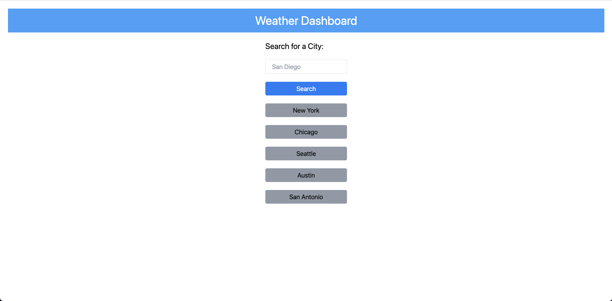
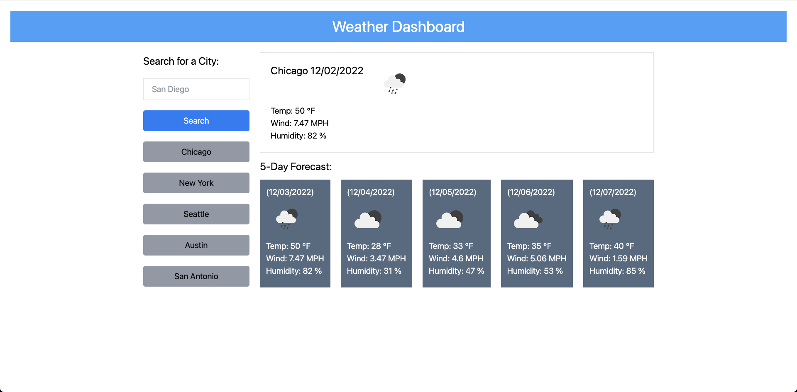

# 06 Server-Side APIs: Weather Dashboard

## User Story

```
AS A bootcamp student
I WANT to create a weather web application so those traveling can see the weather outlook for multiple cities
SO THAT they can plan their trip accordingly
```

## Acceptance Criteria

```
GIVEN a weather dashboard with search functionality
WHEN I search for a city
THEN I am presented with the current and future weather conditions for that city, city is added the search history (local storage)
WHEN I view the current weather conditions for my searched city
THEN I am present with the city's name, date, image of weather condition, temperature, wind speed, and humidity
WHEN I view the future weather conditions for my searched city
THEN I am presented with a 5-day forecast displaying the future date, image of weather condition, temperature, wind speed, and humidity
WHEN I refresh the weather dashboard
THEN I am presented with recent searches under the search bar
WHEN I search for a new city
THEN I am again presented with current and future weather conditions
WHEN I refresh the page
THEN I am presented with my recent searched city at the top of the list of "recent searches"

*** recent searches holds 8 most recent cities: local storage holds all searches and updates accordingly [no duplicate searches]
*** need to note that at 9pm, 'data.list[0]' will display the following day causing current weather conditions to read as the next day
```

## Mock-Up

The following image shows the weather application at first glace- showing only the search bar and recent searches.



The following image shows the weather application after searching for a city.


